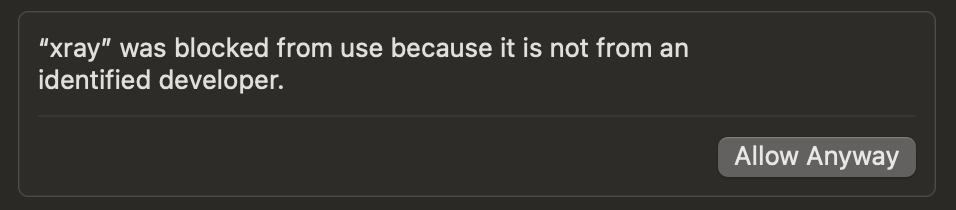

# mac-fragment-scanner
mac fragment scanner

If you don't have homebrew, install it using this command:

/bin/bash -c "$(curl -fsSL https://raw.githubusercontent.com/Homebrew/install/HEAD/install.sh)"

Install PowerShell using Homebrew:

brew install --cask powershell

Get the lastest xray core:

https://github.com/XTLS/Xray-core/releases

Navigate to your directory, make sure config and xray are in the same directory:

cd path/to/your/directory

Make xray executable:

chmod +x ./xray

Run the script:

./mac2.ps1

If you got an error that doesn't let xray run, go to settings, privacy and allow it:

